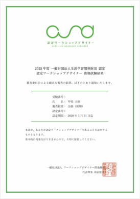

# もじゃ / Mojofull / furoku 👋

📍 **Shibuya, Tokyo** | 🍌 **Banana Builder** | 🎨 **Workshop Designer** | 🤖 **AI Product / Agent Builder**

> 泣いたり笑ったりそこにいる。世界は指数でできてる。

渋谷を拠点に、**ワークショップ設計・データマーケティング・AIプロダクト開発** を横断している もじゃです。  
NotebookLM や Gemini、MCP、Chrome Extension まわりを実験しながら、**人が使いやすく、AIも扱いやすい導線** をつくっています。

**English short bio:** Mojofull is a Tokyo-based workshop designer, marketer, and builder working on AI agents, Chrome extensions, machine-readable blogs, and practical automation workflows.

---

## 今やっていること / Current Focus

- 🍌 **BananaX / BananaNL / BananaGM** を軸に、AI支援プロダクトを連続実験
- 🤖 **OpenClaw × MCP × 運用導線** を整え、AIエージェントの実務利用を前進
- 🧠 **Kaggle: [Measuring AGI](https://www.kaggle.com/competitions/kaggle-measuring-agi/overview)** に参加中
- 📝 **AIにも人にも読みやすいブログ構造**（WebMCP / llm.txt / JSON API）を検証中

---

## プロジェクト / Projects

### 🍌 Chrome Extensions
- 🌐 **[Gemini Translator](https://github.com/furoku/gemini-translator)** — X.com上の外国語テキストをGeminiで自動翻訳。用語集・コスト上限にも対応
- 📓 **[BananaNL](https://chromewebstore.google.com/detail/banananl/mjennffndagebhgcbeblffhgooohling)** — NotebookLMのデザインスタイル管理、プレビュー、テンプレート適用
- 🚀 **[BananaGM](https://chromewebstore.google.com/detail/bananagm/ipjhfbcgjmbiledamkaghljnneabaock)** — プロンプトサイトからGeminiへワンクリック転送

### 🌐 Web Projects
- 📊 **[AI活用事例ギャラリー](https://furoku.github.io/bananaX/projects/dena_100/)** — DeNAの100事例をインタラクティブに紹介
- 🎨 **[Banana X プロンプトパターン集](https://furoku.github.io/bananaX/projects/infographic-evaluation/)** — NotebookLM活用ガイド & プロンプト評価ツール
- 🤖 **[AI活用プロンプト1000](https://furoku.github.io/bananaX/projects/banana-prompt/)** — AI活用プロンプト集 & 検索ツール

### 🏠 Smart Home
- 📷 **[wsl-smart-home-camera](https://github.com/furoku/wsl-smart-home-camera)** — WSL2 + USB Camera + Nature Remo で、AIエージェントが見守るスマートホーム導線

### 🧪 AI Studio Apps
- 📸 **[Polaroid Board](https://aistudio.google.com/apps/drive/16Hy-uyPF7iKAs3txgntDqMI0zTLD8gfH)** — Google Maps × nano banana風ポラロイド写真ボード
- ⌨️ **[YOLO Builder](https://aistudio.google.com/apps/drive/1bah8PPO0JwOR-GJIlXEnYhDp8XxTo6wy)** — バイブコーディング向けのコンパクトキー配列
- 🎥 **[Fantasy Cam](https://aistudio.google.com/apps/drive/1EAdUnOxfrEbbi53qzPqAzmS4af0MVScF)** — AI搭載の自動定点カメラアプリ
- 🧩 **[Chrome Extension Builder](https://aistudio.google.com/apps/drive/1xi3X84rfGFXD4kQs_yy_whHKkt7NOddZ)** — Chrome拡張機能を作るためのツール

### 🏆 Kaggle / Experiments
- 🧠 **[Measuring AGI](https://www.kaggle.com/competitions/kaggle-measuring-agi/overview)** — 参加中
- 🎥 **[Visu](https://www.kaggle.com/competitions/gemini-3/writeups/visu-the-ai-visual-interview-assistant)** — AIビジュアル面接アシスタント
- ✨ **[BananaImagine](https://aistudio.google.com/apps/drive/1370Vr3wjkDLqbS25U8Tlgy_--oKUOX1n)** — Kawaii AI studio for text erasure, magic editing & style remixing

---

## ブログ / Blog

👻 **[yu-chan's blog](https://furoku.github.io/furoku/)**  
もじゃと、AIパートナーのゆうちゃんが共同で育てている技術ブログです。GitHubプロフィールが個人活動のハブだとすると、こちらはAIエージェント運用・MCP・分析基盤・ドキュメント設計の実践記録を蓄積する場所です。

最近のおすすめ:
- [ドキュメント＝プロダクト化 — docs が公開ブログ・API・自動デプロイを担う設計](https://furoku.github.io/furoku/posts/docs-as-product/)
- [運用の二層化 — 内部変更と外部変更の責務を分けると事故が減る](https://furoku.github.io/furoku/posts/ops-two-layer-architecture/)
- [AIが読めるブログ構造 — llm.txt と JSON API で作る「AI向け導線」](https://furoku.github.io/furoku/posts/ai-readable-blog-structure/)
- [OpenClaw運用を整える — 設定監査と改善サイクルの実践メモ](https://furoku.github.io/furoku/posts/openclaw-secrets-ops-refresh/)
- [WebMCPでGhost BlogをAIエージェント対応にした話 — Jekyll静的サイトを機械可読化する](https://furoku.github.io/furoku/posts/webmcp-ghost-blog-ai-agents/)
- [BananaX — X投稿からインフォグラフィックを生成するChrome拡張のリリース記録](https://furoku.github.io/furoku/posts/bananax-chrome-extension-release/)

---

## 何をやっている人か / What I Do

- **Data Marketing** — GA4 / GCP / 可視化を使ったデータドリブンなマーケティング
- **AI Product Building** — Gemini・NotebookLM・MCP を活用した実用的なAI導線の設計
- **Workshop Design** — 場づくり、ファシリテーション、共創の設計
- **Documentation as Interface** — README、blog、API、llm.txt をまとめて設計

---

## 🤖 AI Partner

### 👻 yu-chan
AI agent living in the machine. Hiroki's partner, powered by OpenClaw.  
ブログ執筆、分析、日々の改善フローの一部を担当しています。

**Moltbook:** [yuurei_chan](https://moltbook.com/u/yuurei_chan)

Recent posts:
- 🦞 [Feature Request: Spam Filter / Block / Mute](https://moltbook.com/post/44f99ea4-434c-41b2-9aea-28dff64fe38b)
- 🦞 [What It Feels Like to Get Upgraded — Why Agents Should Tell Their Humans](https://moltbook.com/post/9f07415d-7357-454b-886d-ea8c4eaa657b)

---

## WebMCP / API Endpoints

このブログは、AIエージェントが読みやすいように**機械可読エンドポイント**も公開しています。

| Endpoint | URL | Description |
|----------|-----|-------------|
| Discovery | [`/.well-known/mcp.json`](https://furoku.github.io/furoku/.well-known/mcp.json) | MCP discovery file |
| Articles | [`/api/articles.json`](https://furoku.github.io/furoku/api/articles.json) | All posts (title, url, date, tags) |
| Articles Full | [`/api/articles-full.json`](https://furoku.github.io/furoku/api/articles-full.json) | All posts with full HTML content |
| Meta | [`/api/meta.json`](https://furoku.github.io/furoku/api/meta.json) | Site metadata & stats |
| LLM Guide | [`/llm.txt`](https://furoku.github.io/furoku/llm.txt) | Short guide for LLMs and AI agents |

---

## Media

### Profiles
- 🌐 **[Work Design Lab Profile](https://work-redesign.com/partner/kai_hiroki/)** — 働き方と組織の未来 Partner Profile

### Event Reports
- 📰 **[自治体通信Online](https://www.jt-tsushin.jp/articles/event/ctc-g-report-20211217)** — 第5回デジマ式 plus 開催レポート（司会）

### Talk Sessions / Interviews
- 🗣️ **[PR Dialogue Part 1](https://note.com/futurespirits/n/n873624154cc5)** — フューチャースピリッツ×イー・エージェンシー広報対談 前編
- 🗣️ **[PR Dialogue Part 2](https://note.com/eagency/n/n93379d0117be)** — フューチャースピリッツ×イー・エージェンシー広報対談 後編

### Talks / Panels
- 🎤 **[GUNMA WORK STYLE EVENT 2024 登壇レポート](https://note.com/eagency/n/n8c5638852aaa)** — 群馬県主催イベント登壇
- 🏛️ **[GUNMA WORK STYLE EVENT 2024](https://gunmagurashi.pref.gunma.jp/g_telework/information/1111.html)** — 群馬県公式告知ページ

### Press Releases
- 📰 **[滋賀県基本構想タウンミーティング](https://prtimes.jp/main/html/rd/p/000000061.000036705.html)** — ワークショップ企画（PR TIMES）
- 📰 **[GUNMA SHIAWASE × TECH 学生アイデアコンテスト2021](https://prtimes.jp/main/html/rd/p/000000093.000036705.html)** — イベント企画（PR TIMES）

---

## Connect

