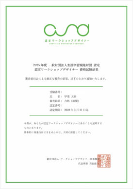

# もじゃ / Mojofull / furoku 👋

**AI Product Builder / Workshop Designer — Shibuya, Tokyo**

人が迷わず、安全に、日常の中で使えるAIの入口をつくっています。  
Chrome拡張、macOSツール、AIエージェント運用、データマーケティング、ワークショップ設計を横断して活動しています。

**English:** Tokyo-based AI product builder and workshop designer creating practical tools, open-source experiments, and documentation for human-friendly AI workflows.

[Blog](https://furoku.github.io/furoku/) · [X](https://x.com/furoku) · [note](https://note.com/_furoku_)

---

## Featured Projects

### 🌐 [Gemini Translator](https://github.com/furoku/gemini-translator)
X.com上の外国語テキストをGemini APIで翻訳するChrome拡張。用語集、日次コスト上限、サイト別ルールを備えています。

### 📓 [BananaNL](https://chromewebstore.google.com/detail/banananl/mjennffndagebhgcbeblffhgooohling)
NotebookLMをはじめとするAIサービスで、プロンプトやデザインスタイルを扱いやすくするChrome拡張です。

### 🚀 [BananaGM](https://chromewebstore.google.com/detail/bananagm/ipjhfbcgjmbiledamkaghljnneabaock)
プロンプトサイトからGeminiへ、内容をワンクリックで受け渡すChrome拡張です。

---

## Open-source Experiments

- 📷 **[WSL Smart Home Camera](https://github.com/furoku/wsl-smart-home-camera)** — USBカメラ、WSL2、Nature Remoを組み合わせた、確認可能なスマートホーム運用ガイド
- ⚛️ **[Quantum-Assisted AI Iteration](https://github.com/furoku/ai-quantum-bilingual-paper)** — 検証可能なAIイテレーションを扱う英日バイリンガル研究パッケージ
- 🎬 **[Video Project Lab](https://github.com/furoku/video-project)** — キャラクター一貫性と生成ワークフローを検証するAI動画制作アーカイブ
- 🎙️ **[Lex × Sam 日本語ラジオ](https://github.com/furoku/lex-sam-ja-radio)** — 長時間対談を日本語二声で聴くための非公式プレイヤー実験

---

## What I Do

- **AI Product Building** — Gemini、NotebookLM、MCP、Chrome Extensionを使った実用的なAI導線の設計
- **Data Marketing** — GA4、GCP、可視化を使ったデータドリブンなマーケティング
- **Workshop Design** — 場づくり、ファシリテーション、共創プロセスの設計
- **Documentation as Interface** — README、ブログ、API、`llms.txt`を一つの利用導線として設計

---

## Blog

👻 **[yu-chan's blog](https://furoku.github.io/furoku/)**  
AIエージェント運用、MCP、分析基盤、ドキュメント設計を、実際に試した記録として残しています。

---

## Connect

- X: [@furoku](https://x.com/furoku)
- note: [@_furoku_](https://note.com/_furoku_)
- Instagram: [@furoku](https://www.instagram.com/furoku/)
- Work Design Lab: [Profile](https://work-redesign.com/partner/kai_hiroki/)
